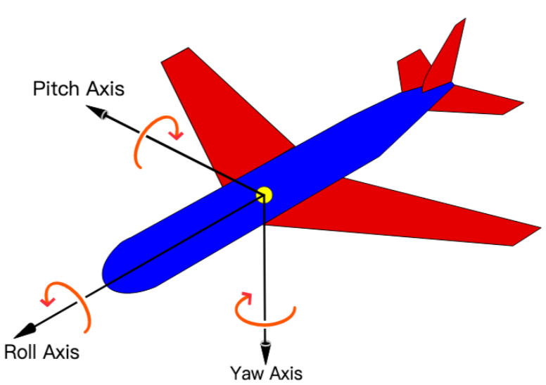

## 属性

### **按键**

#### entity.player.disableInputDirection **: **GameInputDirection
> 默认值：GameInputDirection.NONE

**禁用指定方向的摇杆输入偏移量，当横纵两个方向均被禁用时，将不显示此玩家的触屏虚拟摇杆。**

---

#### entity.player.**enableAction0 : boolean**
> 默认值：true

**启动鼠标左键/移动端虚拟按钮A键**

---

#### entity.player.**enableAction1 : boolean**
> 默认值：true

**启动鼠标右键/移动端虚拟按钮B键**

---

#### entity.player.**action0Button : boolean**
> 默认值：false

**鼠标左键/移动端虚拟按钮A键**

---

#### entity.player.**action1Button : boolean**
> 默认值：false

**鼠标右键/移动端虚拟按钮B键**

---

#### entity.player.**jumpButton : boolean**
> 默认值：false

**跳跃按钮**

---

#### entity.player.**walkButton : boolean**
> 默认值：false

**步行按钮**

### **行动**

#### 🧪实验性entity.player.**swapInputDirection : **boolean
> 默认值：false

**是否交换方向按键**
:::warning
相对摄像机视角而言：

不开启：w：前进，s：后退，a：左走，d：右走

开启：w：右走，s：左走，a：后退，d：前进
:::

---

#### 🧪实验性entity.player.reverseInputDirection **: **GameInputDirection
> 默认值：GameInputDirection.NONE

**反转指定方向的摇杆**

---

#### entity.player.**facingDirection : **[GameVector3](https://www.yuque.com/box3lab/api/sug8utrs043aep5v)
> 默认值：GameVector3(1, 0, 0)

**玩家朝向**

---

#### entity.player.**canFly : boolean**
> 默认值：false

**如果为真(true)，则允许玩家飞行**

---

#### entity.player.**spectator : boolean**
> 默认值：false

**如果为真(true)，则玩家是一个幽灵，可以穿墙**

---

#### entity.player.**enableJump : boolean**
> 默认值：true

**如果为假(false)，则不允许玩家跳跃**

---

#### entity.player.**enableDoubleJump : boolean**
> 默认值：true

**如果为假(false)，则不允许玩家二段跳跃**

---

#### entity.player.**walkSpeed : **number
> 默认值：0.22

**最大步行速度**

---

#### entity.player.**runSpeed : **number
> 默认值：0.4

**最大奔跑速度**

---

#### entity.player.**runAcceleration : **number
> 默认值：0.35

**奔跑加速度**

---

#### entity.player.**jumpPower : **number
> 默认值：0.96

**跳跃力度**

---

#### entity.player.**jumpSpeedFactor : **number
> 默认值：0.85

**跳跃速度**

---

#### entity.player.**jumpAccelerationFactor : **number
> 默认值：0.55

**跳跃加速率**

---

#### entity.player.**doubleJumpPower : **number
> 默认值：0.9

**二段跳力度**

---

#### entity.player.**crouchSpeed : **number
> 默认值：0.1

**蹲着走路的速度**

---

#### entity.player.**crouchAcceleration : **number
> 默认值：0.09

**蹲着走路的加速度**

---

#### entity.player.**flySpeed : **number
> 默认值：2

**最大飞行速度**

---

#### entity.player.**flyAcceleration : **number
> 默认值：2

**飞行加速度**

---

#### entity.player.**swimAcceleration : **number
> 默认值：0.1

**游泳加速度**

---

#### entity.player.**swimSpeed : **number
> 默认值：0.4

**最大游泳速度**

---

#### entity.player.**walkAcceleration : **number
> 默认值：0.19

**步行加速度**

---

#### 只读entity.player.**moveState : **[GamePlayerMoveState](#TzBdh)
> 默认值：GamePlayerMoveState.FALL

**玩家的运动状态**

---

#### 只读entity.player.**walkState : **[GamePlayerWalkState](#TbRiL)
> 默认值： [GamePlayerWalkState](https://box3.yuque.com/org-wiki-box3-ev7rl4/wupvz3/nfty4bko9nn3kyiv).NONE

**玩家的步行状态**

---

#### 只读entity.player.**cameraPitch : **number
> 默认值：0

**玩家视角准心绕水平方向的旋转弧度**

---

#### 只读entity.player.**cameraYaw : **number
> 默认值：0

**玩家视角准心绕垂直方向的旋转弧度**

## 方法

#### 事件**entity.player.onPress**(handler:(event:[**GameInputEvent**](https://www.yuque.com/box3lab/api/qkt62q3lzcc0klcb#KqehP))=>void) : [GameEventHandlerToken](https://www.yuque.com/box3lab/api/gll7mhwasgn9hoq0)
**当玩家按下按钮时调用**

**输入参数**

| **参数** | **必填** | **默认值** | **类型** | **说明** |
| --- | --- | --- | --- | --- |
| handler | _是_ | | function | 监听到玩家按下按钮时的处理函数 |

---

#### 事件**entity.player.onRelease**(handler:(event:[**GameInputEvent**](https://www.yuque.com/box3lab/api/qkt62q3lzcc0klcb#KqehP))=>void) : [GameEventHandlerToken](https://www.yuque.com/box3lab/api/gll7mhwasgn9hoq0)
**当玩家松开按钮时调用**

**输入参数**

| **参数** | **必填** | **默认值** | **类型** | **说明** |
| --- | --- | --- | --- | --- |
| handler | _是_ | | function | 监听到玩家松开按钮时的处理函数 |

---

#### 事件**entity.player.onKeyDown**(handler:(event:[**GameKeyBoardEvent**](https://www.yuque.com/box3lab/api/qkt62q3lzcc0klcb#KqehP))=>void) : [GameEventHandlerToken](https://www.yuque.com/box3lab/api/gll7mhwasgn9hoq0)
**当玩家按下键盘时调用**

**输入参数**

| **参数** | **必填** | **默认值** | **类型** | **说明** |
| --- | --- | --- | --- | --- |
| handler | _是_ | | function | 监听到玩家按下键盘时的处理函数 |

---

#### 事件**entity.player.onKeyUp**(handler:(event:[**GameKeyBoardEvent**](#anWjP))=>void) : [GameEventHandlerToken](https://www.yuque.com/box3lab/api/gll7mhwasgn9hoq0)
**当玩家松开键盘时调用**

**输入参数**

| **参数** | **必填** | **默认值** | **类型** | **说明** |
| --- | --- | --- | --- | --- |
| handler | _是_ | | function | 监听到玩家松开键盘时的处理函数 |

---

#### **entity.player.kick**() `:  void`
**把该玩家"踢出"当前地图**

## 接口

#### GameKeyBoardEvent
**输入事件，在玩家按下或松开按键时触发。**

| **参数** | **类型** | **说明** |
| --- | --- | --- |
| keyCode | _number_ | 按下/松开按键的[keyCode](#mBDKq) |
| tick | _number_ | 按下/松开按钮的时间 |

## **枚举**

#### GamePlayerMoveState
**玩家的运动状态**

| **属性** | **说明** |
| --- | --- |
| FLYING | 飞行中 |
| GROUND | 在地上 |
| SWIM | 游泳中 |
| FALL | 下落中 |
| JUMP | 跳跃中 |
| DOUBLE_JUMP | 二段跳中 |

---

#### **GamePlayerWalkState **
**玩家的行走状态**

| **属性** | **说明** |
| --- | --- |
| NONE | 非行走中 |
| CROUCH | 下蹲行走 |
| WALK | 正常步行 |
| RUN | 奔跑 |

---

#### GameInputDirection
**玩家通过输入设备控制移动时的方向**

| **属性** | **说明** |
| --- | --- |
| NONE | 无，代表不禁用 |
| VERTICAL | 垂直方向 |
| HORIZONTAL | 水平方向 |
| BOTH | 所有方向 |

## keyCode映射表
| **字母和数字键的键码值** |  |  |  |  |  |  |  |
| --- | --- | --- | --- | --- | --- | --- | --- |
| 按键 | 键码 | 按键 | 键码 | 按键 | 键码 | 按键 | 键码 |
| **A** | 65 | **J** | 74 | **S** | 83 | **1** | 49 |
| **B** | 66 | **K** | 75 | **T** | 84 | **2** | 50 |
| **C** | 67 | **L** | 76 | **U** | 85 | **3** | 51 |
| **D** | 68 | **M** | 77 | **V** | 86 | **4** | 52 |
| **E** | 69 | **N** | 78 | **W** | 87 | **5** | 53 |
| **F** | 70 | **O** | 79 | **X** | 88 | **6** | 54 |
| **G** | 71 | **P** | 80 | **Y** | 89 | **7** | 55 |
| **H** | 72 | **Q** | 81 | **Z** | 90 | **8** | 56 |
| **I** | 73 | **R** | 82 | **0** | 48 | **9** | 57 |

| **数字键盘上的键的键码值** |  |  |  | **功能键键码值** |  |  |  |
| --- | --- | --- | --- | --- | --- | --- | --- |
| 按键 | 键码 | 按键 | 键码 | 按键 | 键码 | 按键 | 键码 |
| **0** | 96 | **8** | 104 | **F1** | 112 | **F7** | 118 |
| **1** | 97 | **9** | 105 | **F2** | 113 | **F8** | 119 |
| **2** | 98 | ***** | 106 | **F3** | 114 | **F9** | 120 |
| **3** | 99 | **+** | 107 | **F4** | 115 | **F10** | 121 |
| **4** | 100 | **Enter** | 108 | **F5** | 116 | **F11** | 122 |
| **5** | 101 | **-** | 109 | **F6** | 117 | **F12** | 123 |
| **6** | 102 | **.** | 110 |  |  |  |  |
| **7** | 103 | **/** | 111 |  |  |  |  |

| **控制键键码值** |  |  |  |  |  |  |  |
| --- | --- | --- | --- | --- | --- | --- | --- |
| 按键 | 键码 | 按键 | 键码 | 按键 | 键码 | 按键 | 键码 |
| **BackSpace** | 8 | **Esc** | 27 | **Right Arrow** | 39 | **-_** | 189 |
| **Tab** | 9 | **Spacebar** | 32 | **Dw Arrow** | 40 | **.>** | 190 |
| **Clear** | 12 | **Page Up** | 33 | **Insert** | 45 | **/?** | 191 |
| **Enter** | 13 | **Page Down** | 34 | **Delete** | 46 | **`~** | 192 |
| **Shift** | 16 | **End** | 35 | **Num Lock** | 144 | **[{** | 219 |
| **Control** | 17 | **Home** | 36 | **;:** | 186 | **\\&#124;** | 220 |
| **Alt** | 18 | **Left Arrow** | 37 | **=+** | 187 | **]}** | 221 |
| **Caps Lock** | 20 | **Up Arrow** | 38 | **,<** | 188 | **'"** | 222 |

| **多媒体键码值** |  |  |  |  |  |  |  |
| --- | --- | --- | --- | --- | --- | --- | --- |
| 按键 | 键码 | 按键 | 键码 | 按键 | 键码 | 按键 | 键码 |
| **音量加** | 175 |  |  |  |  |  |  |
| **音量减** | 174 |  |  |  |  |  |  |
| **停止** | 179 |  |  |  |  |  |  |
| **静音** | 173 |  |  |  |  |  |  |
| **浏览器** | 172 |  |  |  |  |  |  |
| **邮件** | 180 |  |  |  |  |  |  |
| **搜索** | 170 |  |  |  |  |  |  |
| **收藏** | 171 |  |  |  |  |  |  |

